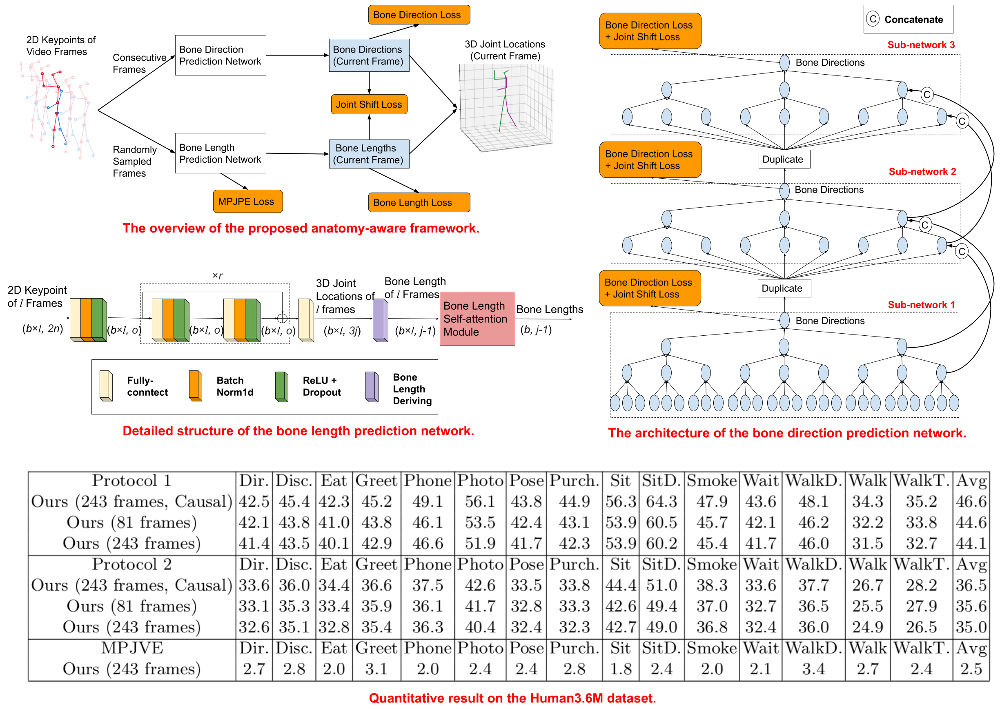

# Anatomy-aware 3D Human Pose Estimation in Videos



PyTorch code of the paper "Anatomy-aware 3D Human Pose Estimation in Videos". It is built on top of [VideoPose3D](https://github.com/facebookresearch/VideoPose3D).

Tianlang Chen, Chen Fang, Xiaohui Shen, Yiheng Zhu, Zhili Chen, Jiebo Luo. "Anatomy-aware 3D Human Pose Estimation in Videos", arxiv, 2020. [pdf](https://arxiv.org/pdf/2002.10322.pdf)

### Environment

The code is developed and tested on the following environment

* Python 3.6.10
* PyTorch 1.0.1
* CUDA 9.0

### Dataset

The source code is for training/evaluating on the [Human3.6M](http://vision.imar.ro/human3.6m) dataset. Our code is compatible with the dataset setup introduced by [Martinez et al.](https://github.com/una-dinosauria/3d-pose-baseline) and [Pavllo et al.](https://github.com/facebookresearch/VideoPose3D). Please refer to [VideoPose3D](https://github.com/facebookresearch/VideoPose3D) to set up the Human3.6M dataset (`./data` directory).

To experiment with another dataset, you need to set up the dataset in the same way as the Human3.6M dataset. In addition, you need to modify `--boneindex` (./common/arguments.py) and `randomaug()` (./common/generators.py) to update the index mapping between joints and bones.

### Visibility Score

As described in our paper, we provide the 2D keypoint visibility scores of the Human3.6M dataset predicted by [AlphaPose](https://github.com/MVIG-SJTU/AlphaPose). You need to download the score file from [here](https://drive.google.com/file/d/1C3A9t9FqKgT_GLROBKV0v3lnl5NXOLYN/view?usp=sharing) and put it into the `./data` directory.

### Training new models

To train a model from scratch, run:

```bash
python run.py -e xxx -k cpn_ft_h36m_dbb -arc xxx --randnum xxx
```

As [VideoPose3D](https://github.com/facebookresearch/VideoPose3D), `-arc` controls the backbone architecture of our bone direction prediction network (and also the corresponding layer number of our bone length prediction network). `--randnum` indicates the randomly sampled input frame number of the bone length prediction network. 

For example, to train our 243-frame standard model and causal model in our paper, please run:

```bash
python run.py -e 60 -k cpn_ft_h36m_dbb -arc 3,3,3,3,3 --randnum 50
```

and

```bash
python run.py -e 60 -k cpn_ft_h36m_dbb -arc 3,3,3,3,3 --randnum 50 --causal
```

`-arc 3,3,3,3,3` should require 80 hours to train on 3 GeForce GTX 1080 Ti GPUs.
`-arc 3,3,3,3` should require 60 hours to train on 2 GeForce GTX 1080 Ti GPUs.

### Evaluating pre-trained models

We provide the pre-trained 243-frame model [here](https://drive.google.com/file/d/17QIbAWfCP5fwiz9MhFw1pRBZ_2VlgMSU/view?usp=sharing). To evaluate it, put it into the `./checkpoint` directory and run:

```bash
python run.py -k cpn_ft_h36m_dbb -arc 3,3,3,3,3 --evaluate pretrained_model.bin
```

### Visualization and other functions

We keep our code consistent with [VideoPose3D](https://github.com/facebookresearch/VideoPose3D). Please refer to their project page for further information. 


### Reference

If you found this code useful, please cite the following paper:

    @article{chen2020anatomy,
      title={Anatomy-aware 3D Human Pose Estimation in Videos},
      author={Chen, Tianlang and Fang, Chen and Shen, Xiaohui and Zhu, Yiheng and Chen, Zhili and Luo, Jiebo},
      journal={arXiv preprint arXiv:2002.10322},
      year={2020}
    }

## Acknowledgement

Part of our code is borrowed from [VideoPose3D](https://github.com/facebookresearch/VideoPose3D). We thank to the authors for releasing codes.

